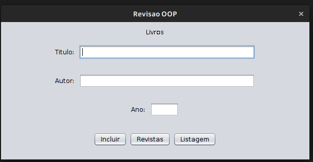
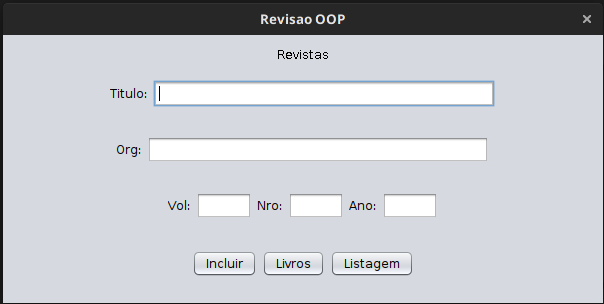
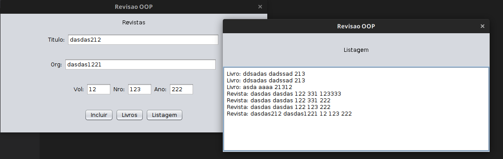
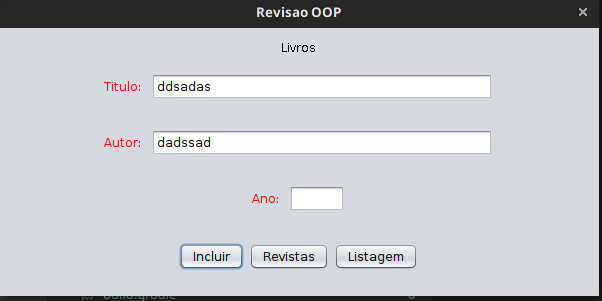

# Revisão OOP

Resolução do exercício [Prova Substitutiva](docs/Prova%20Substitutiva%201.pdf)

## Single Principle Responsibility

Nessa questão, percebi que o problema pode ser dividido nos subproblemas:

- Problema de Navegação em um aplicativo

- Problema de submissão de um dado por meio de um formulário

- Problema do armazenamento de dados

- Problema de visualização de dados armazenados

Busquei tentar o máximo de coesão nas classes criando uma classe responsável criei as seguintes classes:

- para a navegação entre telas [SwingNavigator][SwingNavigator],

- para cada formulário [BookSwingForm][BookSwingForm],
[ReviewSwingForm][ReviewSwingForm],

- para o armazenamento de dados [LibraryDataBase][LibraryDataBase]

- uma view simples para visualizar os dados [ListPageSwing][ListPageSwing]

Observe que toda classe que possui __Swing__ no nome faz parte do domínio da view.

## Falhas ao Aplicar o SPR

Uma dificuldade encontrada durante essa atividade foi uma forma de refatorar o código da
tela de formulário, infelizmente não tive conhecimento de aplicar algum design pattern ou
lógica para eliminar a duplicação de código presente nas classes [AddBookPageSwing][AddBookPageSwing]
e [AddReviewPageSwing][AddReviewPageSwing], basicamente ambas possuem o mesmo código de inicialização
só mudam o tipo de formulário.

```java
public class AddBookPageSwing extends javax.swing.JFrame {
    // em AddReviewPageSwing muda o valor para Revistas
    public static final String pageName = "Livros"; 

    private final BookSwingForm bookForm;
    final MenuButtonsSwing menuButtons;

    final LibraryDataBase database;

    public AddBookPageSwing() {
        setTitle(APP_NAME);
        setMinimumSize(new Dimension(MIN_SIZE_IN_PIXELS * 2, MIN_SIZE_IN_PIXELS));
        setDefaultCloseOperation(JFrame.EXIT_ON_CLOSE);
        setVisible(true);

        database = LibraryDataBase.getInstance(); // Singleton
        bookForm = new BookSwingForm(); // muda  para new ReviewSwingForm(); 
        menuButtons = new MenuButtonsSwing(pageName);

        buildContainer();

        menuButtons.addButton.addActionListener(new ActionListener() {
            @Override
            public void actionPerformed(ActionEvent actionEvent) {

                try {
                    database.add(bookForm.getModel());
                    bookForm.labelsToBlack();

                } catch (IncorrectInputError error) {
                    bookForm.labelsToRed();
                }


            }
        });


        pack();
    }

    private void buildContainer() {
        Container container = getContentPane();

        container.setLayout(new BoxLayout(container, BoxLayout.Y_AXIS));

        container.add(new Label(pageName, Label.CENTER));

        container.add(bookForm);

        container.add(menuButtons);
    }
}
```

Esse problema provoca que se for necessário criar uma outra tela para por exemplo uma nova
estrutura chamada __Jornal__, será necessário basicamente copiar e colocar essa classe e
adicionar um novo método em [LibraryDataBase][LibraryDataBase] __addJournal__

```java
//LibraryDataBase.java

void addBook(Book b){
    ...
}

void addReview(Review b){
    ...
}

void addJournal(Journal j){
    //....
}
```

Penso que modificar LibraryDataBase não está errado, uma vez que
adicionar uma nova estrutura realmente provoca uma mudança no LibraryDataBase
mas se continuar sempre adicionando um novo método, eventualmente ficara extremamente
difícil de prestar manutenção, pois se escrevo 70 linhas por estrutura, se eu tiver
5 estruturas, logo  70*5 = 1050 linhas de código. Imagino que uma biblioteca de verdade
tenha mais que 5 estruturas.

## Design Patterns Utilizados

Ao longo do trabalho só foi utilizado um único design pattern o [Singleton][SingletonWiki]
Esse padrão garante que a existência de um única classe para toda a aplicação, ela foi utilizado
tanto na classe de armazenamento [LibraryDataBase][LibraryDataBase] tanto no navegador [SwingNavigator][SwingNavigator], onde ao meu ver, na aplicação haver apenas uma estância
de classe que controla a navegação do app, como sómente uma única classe responsável
para o armazenamento de dados.

## Conclusão

Como feito anteriormente através de uma simples conta de matemática, para cada nova
estrutura o número de linhas em um arquivo iria crescer linearmente, junto com número de
__SwingPages__:

```c
f(x) = 70x
//e o número de paginas também cresceria linearmente
f(x) = x
```

A aplicação foi ou meu ver bem dividia em subproblemas mas, é uma gambiarra. Infelizmente não sei ajeitar, desculpe a minha ignorância.

## Para executar a aplicação

```bash
# no linux, mac
./gradlew run
# Talvez no windows seja
 gradlew run 
```

## Prints da Aplicação









[ListPageSwing]:src/main/java/reviso_oop/listItens/ListPageSwing.java
[LibraryDataBase]:src/main/java/reviso_oop/libraryDataBase/LibraryDataBase.java
[BookSwingForm]:src/main/java/reviso_oop/addModel/BookSwingForm.java
[ReviewSwingForm]:src/main/java/reviso_oop/addModel/ReviewSwingForm.java.java
[AddBookPageSwing]:src/main/java/reviso_oop/addModel/AddBookPageSwing.java
[AddReviewPageSwing]:src/main/java/reviso_oop/addModel/AddReviewPageSwing.java
[SwingNavigator]:/src/main/java/reviso_oop/SwingNavigator.java
[SingletonWiki]:https://pt.wikipedia.org/wiki/Singleton
